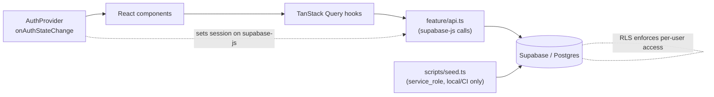

# Architecture

Fullstack recipe application. Client-rendered SPA backed by Supabase.

## Stack

| Concern              | Choice                                   | Notes |
| -------------------- | ---------------------------------------- | ----- |
| Build / dev server   | Vite + React + TypeScript                | SPA, no SSR. |
| Server-state / cache | TanStack Query v5                        | Owns every read/write that touches Supabase. |
| UI primitives        | shadcn/ui + ReUI                         | Both are Radix + Tailwind, copy-in components. They share `components/ui`. |
| Styling              | Tailwind CSS                             | v4 (shadcn default). ReUI supports v3 and v4. |
| Backend              | Supabase — Postgres, Auth, RLS, Storage  | Accessed directly from the browser with the anon key + Row Level Security. |
| Routing              | React Router v7 *(see Open decisions)*   | |
| Testing              | Vitest + React Testing Library, MSW      | Playwright for e2e is optional. |

There is **no custom backend server**. The browser talks to Supabase's auto-generated
REST/Realtime API. All authorization lives in Postgres RLS policies. A separate Node
script (`scripts/seed.ts`) is the only thing that uses the `service_role` key, and it
never ships to the client.

## Data flow



- **Server state** (recipes, favorites, collections, ratings, the session's user row):
  always through TanStack Query. Components never call `supabase` directly.
- **Client state** (open menus, form drafts, theme): local `useState` / context.
- **URL state** (search term, category/area filters, page): router search params, so
  filtered views are shareable and back-button friendly. Query keys include these
  params so the cache keys off them.

## Directory layout (app at repo root)

```
/
├── data/                       # MealDB dump — seed source, NOT bundled into the app
│   ├── recipes.json
│   ├── recipes/                # a.json … z.json
│   ├── ingredients.json
│   ├── categories.json
│   └── area.json
├── scripts/
│   └── seed.ts                 # upserts data/ into Supabase (service_role key)
├── supabase/
│   ├── config.toml
│   ├── migrations/             # schema, versioned, via `supabase db diff`
│   └── seed.sql                # static reference rows (categories, areas)
├── public/
├── src/
│   ├── main.tsx
│   ├── App.tsx                 # router outlet + layout
│   ├── app/
│   │   ├── providers.tsx       # QueryClientProvider > AuthProvider > ThemeProvider
│   │   ├── query-client.ts     # QueryClient defaults
│   │   └── router.tsx          # route tree
│   ├── lib/
│   │   ├── supabase.ts         # createClient(url, anonKey)
│   │   └── utils.ts            # cn()
│   ├── components/
│   │   ├── ui/                 # shadcn + ReUI primitives (generated)
│   │   └── common/             # AppShell, Nav, ErrorState, EmptyState, …
│   ├── features/
│   │   ├── auth/
│   │   │   ├── auth-provider.tsx
│   │   │   ├── use-session.ts
│   │   │   ├── protected-route.tsx
│   │   │   ├── components/     # SignInForm, SignUpForm
│   │   │   └── routes/         # /login, /auth/callback
│   │   ├── recipes/
│   │   │   ├── api.ts          # pure supabase query functions
│   │   │   ├── queries.ts      # useRecipesQuery, useRecipeQuery (wrap api.ts)
│   │   │   ├── mutations.ts    # useCreateRecipe, …
│   │   │   ├── components/     # RecipeCard, RecipeGrid, RecipeDetail, Filters
│   │   │   └── routes/         # /recipes, /recipes/:id
│   │   ├── favorites/
│   │   └── collections/
│   ├── hooks/                  # cross-feature hooks
│   ├── types/
│   │   └── database.ts         # `supabase gen types typescript` output
│   └── styles/index.css        # Tailwind entry + theme tokens
├── .env.example
├── components.json             # shadcn CLI config
└── vite.config.ts
```

**Feature folders** are the unit of organization. Anything used by one feature lives
inside it; promote to `components/common` or `hooks/` only when a second feature needs
it. `components/ui` is the exception — generated primitives, treat as vendored.

## Supabase layer

### Client (`src/lib/supabase.ts`)

```ts
import { createClient } from '@supabase/supabase-js'
import type { Database } from '@/types/database'

export const supabase = createClient<Database>(
  import.meta.env.VITE_SUPABASE_URL,
  import.meta.env.VITE_SUPABASE_ANON_KEY,
  { auth: { persistSession: true, autoRefreshToken: true, detectSessionInUrl: true } },
)
```

One module-level client for the whole app. `@supabase/supabase-js` (not
`@supabase/ssr` — that's for Next/Remix). Session persists in `localStorage` and
refreshes itself.

### Types

`npx supabase gen types typescript --linked > src/types/database.ts`, committed, and
regenerated after every migration. Add it to a `db:types` npm script.

### api.ts pattern

Each feature's `api.ts` holds thin functions that return data or throw:

```ts
export async function listRecipes(params: RecipeFilters) {
  let q = supabase.from('recipes').select('id, name, category, area, thumb_url')
  if (params.category) q = q.eq('category', params.category)
  if (params.search)   q = q.ilike('name', `%${params.search}%`)
  const { data, error } = await q.range(params.offset, params.offset + params.limit - 1)
  if (error) throw error
  return data
}
```

`queries.ts` wraps them in hooks; components only import from `queries.ts` /
`mutations.ts`.

### Schema (initial)

```sql
-- reference data (public read, no client writes)
create table categories (name text primary key);
create table areas (name text primary key, country text);
create table ingredients (
  name text primary key,
  description text,
  image_url text,
  type text
);

-- recipes: MealDB seed rows have created_by = null; user recipes set it to auth.uid()
create table recipes (
  id           text primary key,          -- MealDB idMeal, or gen_random_uuid()::text for user recipes
  name         text not null,
  category     text references categories(name),
  area         text references areas(name),
  country      text,
  instructions text,
  thumb_url    text,
  youtube_url  text,
  source_url   text,
  tags         text[] default '{}',
  created_by   uuid references auth.users(id) on delete cascade,
  is_public    boolean not null default true,
  created_at   timestamptz not null default now()
);

create table recipe_ingredients (
  recipe_id  text references recipes(id) on delete cascade,
  position   int not null,
  ingredient text not null,
  measure    text,
  primary key (recipe_id, position)
);

-- per-user data
create table favorites (
  user_id    uuid references auth.users(id) on delete cascade,
  recipe_id  text references recipes(id) on delete cascade,
  created_at timestamptz not null default now(),
  primary key (user_id, recipe_id)
);

create table collections (
  id          uuid primary key default gen_random_uuid(),
  user_id     uuid references auth.users(id) on delete cascade not null,
  name        text not null,
  description text,
  created_at  timestamptz not null default now()
);

create table collection_recipes (
  collection_id uuid references collections(id) on delete cascade,
  recipe_id     text references recipes(id) on delete cascade,
  position      int not null default 0,
  primary key (collection_id, recipe_id)
);

create table ratings (
  user_id    uuid references auth.users(id) on delete cascade,
  recipe_id  text references recipes(id) on delete cascade,
  score      int not null check (score between 1 and 5),
  review     text,
  created_at timestamptz not null default now(),
  primary key (user_id, recipe_id)
);
```

### RLS (enable on every table)

| Table                                  | select                                    | insert / update / delete |
| -------------------------------------- | ----------------------------------------- | ------------------------- |
| `categories`, `areas`, `ingredients`   | `true`                                    | none (seed only)          |
| `recipes`                              | `is_public or created_by = auth.uid()`    | `created_by = auth.uid()` |
| `recipe_ingredients`                   | via parent recipe visibility              | via parent recipe owner   |
| `favorites`, `ratings`                 | `user_id = auth.uid()`                    | `user_id = auth.uid()`    |
| `collections`, `collection_recipes`    | `user_id = auth.uid()` (own collections)  | `user_id = auth.uid()`    |

RLS is the entire authorization model — there is no server code to enforce it
elsewhere. Write a policy test (SQL or a Vitest integration test hitting a test
project) for each rule.

## Auth

SPA flow with `supabase-js`:

1. `AuthProvider` calls `supabase.auth.getSession()` on mount, then subscribes with
   `supabase.auth.onAuthStateChange`. It exposes `{ session, user, loading }`.
2. `useSession()` / `useUser()` read that context.
3. `<ProtectedRoute>` renders an outlet when `session` exists, else redirects to
   `/login` (preserving `?redirect=`).
4. On `SIGNED_OUT`, call `queryClient.clear()` so no other user's cached data leaks.
5. Sign-in methods: email + password to start; magic link and OAuth (Google / GitHub)
   are drop-in later. Set **Site URL** and **Redirect URLs** in the Supabase
   dashboard for `localhost` and the deployed origin.

Don't put the session in TanStack Query — it's push-based (`onAuthStateChange`), not
fetch-based. Query owns the *data*, the provider owns the *session*.

## TanStack Query conventions

`src/app/query-client.ts`:

```ts
new QueryClient({
  defaultOptions: {
    queries: { staleTime: 60_000, gcTime: 5 * 60_000, retry: 1, refetchOnWindowFocus: false },
    mutations: { retry: 0 },
  },
})
```

Query key shape (hierarchical, filters last):

```
['recipes', 'list', filters]      ['recipes', 'detail', id]
['favorites', userId]             ['collections', userId]
['collections', 'detail', id]     ['ratings', recipeId]
```

- Mutations invalidate the narrowest key that covers the change; e.g. toggling a
  favorite invalidates `['favorites', userId]` and `['recipes', 'detail', id]`.
- Optimistic updates for favorite/unfavorite and rating (fast, low-stakes).
- Surface errors with a shared `<ErrorState>`; wrap route subtrees in an error
  boundary + `QueryErrorResetBoundary`.

## Seed pipeline

The `data/` JSON is **not** imported by the app. `scripts/seed.ts` (run with
`tsx`, reads `SUPABASE_SERVICE_ROLE_KEY` from a local `.env` that is git-ignored):

1. Upsert `categories.json` → `categories`, `area.json` → `areas`,
   `ingredients.json` → `ingredients`.
2. Stream `recipes/*.json`; for each meal, upsert `recipes` (id = `idMeal`,
   `created_by = null`, `country` from `strCountry`, `area` from `strArea`).
3. Expand `strIngredient1..20` / `strMeasure1..20` into `recipe_ingredients` rows,
   trimming blanks, preserving order.

Idempotent (`upsert` on primary key) so it can re-run after data refreshes.

## Environment

```
# .env.example  (committed)
VITE_SUPABASE_URL=
VITE_SUPABASE_ANON_KEY=

# .env  (git-ignored, local + CI secrets)
SUPABASE_SERVICE_ROLE_KEY=      # seed script only — NEVER prefixed VITE_
```

Only `VITE_`-prefixed vars reach the browser bundle. The `service_role` key must
never get that prefix. Host (Vercel/Netlify) gets the two `VITE_` vars; the Supabase
project is provisioned separately.

## Build & deploy

- `vite build` → static `dist/`, deployable to any static host. Add a SPA fallback
  (rewrite all paths to `/index.html`).
- Schema changes: `supabase migration new` → edit SQL → `supabase db push` →
  regenerate `database.ts`. Never edit the hosted schema by hand.
- CI: typecheck, lint, `vitest run`, `vite build`. Seed runs as a manual/one-off job.

## Testing

- **Unit**: pure functions (ingredient expansion, filter param parsing), hooks with
  a `QueryClientProvider` wrapper.
- **Component**: RTL + MSW intercepting Supabase REST (`/rest/v1/*`).
- **RLS**: integration tests against a disposable Supabase project (or `supabase
  start` locally) asserting each policy.
- **e2e** (optional): Playwright for the sign-up → favorite → collection flow.

## Open decisions

| Decision | Recommendation | Why |
| -------- | -------------- | --- |
| Router: React Router v7 vs TanStack Router | **React Router v7** unless the team wants typed routes | Bigger ecosystem, everyone knows it; TanStack Router's typesafe search params are nice but add a learning curve for a course project. |
| Tailwind v3 vs v4 | **v4** | shadcn's current default; ReUI supports it. Only pick v3 if a required ReUI component hasn't shipped v4 support. |
| OAuth providers at launch | Email+password first, add **Google** before demo | Fewer moving parts to start; Google is a one-checkbox add in Supabase. |
| Recipe detail: store denormalized ingredients on `recipes` (jsonb) vs `recipe_ingredients` table | **Separate table** | Enables "filter by ingredient" and ingredient pages without scanning jsonb. |
| Realtime (live favorites/ratings) | **Skip for v1** | Query invalidation is enough; add Supabase Realtime only if a live feature is required. |
