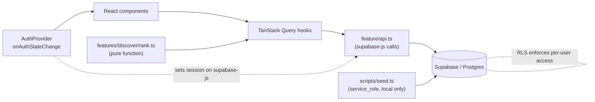

# Architecture

Pantry-first weekly meal planner. Client-rendered SPA backed by Supabase.
Single-player: accounts exist so each user's pantry, plan, grocery list, and
recipes are private to them. See `brief.md` for the product spec.

## Stack

| Concern              | Choice                                   | Notes |
| -------------------- | ---------------------------------------- | ----- |
| Build / dev server   | Vite + React + TypeScript                | SPA, no SSR. |
| Server-state / cache | TanStack Query v5                        | Owns every read/write that touches Supabase. |
| Routing              | React Router v7                          | Declarative route tree in `src/app/router.tsx`. |
| UI primitives        | shadcn/ui + ReUI                         | Both are Radix + Tailwind, copy-in components. They share `components/ui`. |
| Styling              | Tailwind CSS v4                          | shadcn default; ReUI compatible. |
| Backend              | Supabase — Postgres, Auth, RLS          | Accessed directly from the browser with the anon key + Row Level Security. |
| Testing              | Vitest + React Testing Library, MSW      | Playwright e2e optional. |

There is **no custom backend server**. The browser talks to Supabase's
auto-generated REST API. All authorization lives in Postgres RLS policies. A
separate Node script (`scripts/seed.ts`) is the only thing that uses the
`service_role` key, and it never ships to the client.

## Conventions for this team

The team is 4 people with mixed web-dev experience and a December 1 deadline. The
architecture optimizes for *someone reading a file and understanding it quickly*,
not for maximum flexibility.

- **Small, single-purpose components.** If a component file passes ~150 lines or
  has more than a couple of `useState`s doing unrelated things, split it. A page
  route composes small components; it does not contain all the markup itself.
- **Reuse the shared components** instead of re-building list rows and inputs per
  screen. The ones that must be reused:
  - `RecipeCard` — every place a recipe appears in a list (discover, browse, my
    recipes, plan picker, saved).
  - `IngredientPicker` — typeahead over the `ingredients` table; used in pantry,
    recipe create/edit, profile disliked-ingredients, grocery manual-add.
  - `RecipeForm` — shared by the "new recipe" and "edit recipe" routes.
  - `EmptyState`, `ErrorState`, `LoadingState`, `ConfirmDialog` — never hand-roll
    these per screen.
- **Hooks live in their own files**, one concern each. A feature has `queries.ts`
  (read hooks) and `mutations.ts` (write hooks); anything more complex gets its
  own file (`use-suggested-recipes.ts`). Components import hooks — they don't call
  `supabase` or `useQuery` inline.
- **Business logic that isn't React goes in a plain function**, not a hook or a
  component. The ranking algorithm is the main example (`features/discover/rank.ts`).
- **Feature folders are the unit of organization.** Code used by one feature lives
  in that feature. Promote to `components/common` / `hooks/` only when a second
  feature needs it. `components/ui` is vendored primitives — treat as read-only.

## Data flow



- **Server state** (recipes, pantry, plan, grocery, profile): always through
  TanStack Query. Components never call `supabase` directly.
- **Derived state** (ranked suggestions): a pure function fed by query data,
  composed inside `useSuggestedRecipes()`.
- **Client state** (open menus, form drafts, theme): local `useState` / context.
- **URL state** (browse filters, search term): router search params, so views are
  shareable and back-button friendly. Query keys include these params.

## Directory layout (app at repo root)

```
/
├── data/                       # MealDB dump — seed source, NOT bundled into the app
│   ├── recipes.json
│   ├── recipes/                # a.json … z.json
│   ├── ingredients.json
│   ├── categories.json
│   └── area.json
├── scripts/
│   └── seed.ts                 # upserts data/ into Supabase (service_role key)
├── supabase/
│   ├── config.toml
│   ├── migrations/             # schema, versioned
│   └── seed.sql                # optional static reference rows
├── public/
├── src/
│   ├── main.tsx
│   ├── App.tsx                 # router outlet + <AppShell>
│   ├── app/
│   │   ├── providers.tsx       # QueryClientProvider > AuthProvider > ThemeProvider
│   │   ├── query-client.ts     # QueryClient defaults
│   │   └── router.tsx          # route tree
│   ├── lib/
│   │   ├── supabase.ts         # createClient(url, anonKey)
│   │   └── utils.ts            # cn(), text helpers
│   ├── components/
│   │   ├── ui/                 # shadcn + ReUI primitives (generated)
│   │   └── common/             # AppShell, Nav, RecipeCard, IngredientPicker,
│   │                           #   EmptyState, ErrorState, LoadingState, ConfirmDialog
│   ├── features/
│   │   ├── auth/
│   │   │   ├── auth-provider.tsx
│   │   │   ├── use-session.ts
│   │   │   ├── protected-route.tsx
│   │   │   ├── auth-context.ts  # the React context object
│   │   │   ├── components/     # SignInForm (email/password, sign-in + sign-up)
│   │   │   └── routes/         # /login
│   │   ├── profile/            # dietary restrictions, disliked ingredients
│   │   │   ├── api.ts  queries.ts  mutations.ts
│   │   │   ├── components/     # DietTagField, DislikedIngredientsField
│   │   │   └── routes/         # /settings
│   │   ├── pantry/
│   │   │   ├── api.ts  queries.ts  mutations.ts
│   │   │   ├── components/     # PantryList, PantryItemRow
│   │   │   └── routes/         # /pantry
│   │   ├── recipes/            # browse + detail + CRUD (system and user recipes)
│   │   │   ├── api.ts  queries.ts  mutations.ts
│   │   │   ├── components/     # RecipeGrid, RecipeDetail, RecipeForm, RecipeFilters,
│   │   │   │                   #   IngredientRows, SaveRecipeButton
│   │   │   └── routes/         # /recipes, /recipes/:id, /recipes/new,
│   │   │                       #   /recipes/:id/edit, /my-recipes
│   │   ├── discover/           # the pantry-based suggestion engine
│   │   │   ├── rank.ts         # PURE ranking function (unit-tested)
│   │   │   ├── use-suggested-recipes.ts   # composes pantry + profile + recipes + rank
│   │   │   ├── components/     # SuggestionCard, MatchBadge, MissingIngredients
│   │   │   └── routes/         # /discover
│   │   ├── plan/              # weekly planner: 7 day slots
│   │   │   ├── api.ts  queries.ts  mutations.ts
│   │   │   ├── components/     # WeekGrid, DaySlot, RecipePickerDialog
│   │   │   └── routes/         # /plan
│   │   └── grocery/
│   │       ├── api.ts  queries.ts  mutations.ts   # includes the "generate" mutation
│   │       ├── components/     # GroceryList, GroceryItemRow, AddManualItem
│   │       └── routes/         # /grocery
│   ├── hooks/                  # cross-feature hooks (useDebouncedValue, …)
│   ├── types/
│   │   └── database.ts         # `supabase gen types typescript` output
│   └── styles/index.css        # Tailwind entry + theme tokens
├── .env.example
├── components.json             # shadcn CLI config
└── vite.config.ts
```

## Routes

| Path | Auth | Purpose |
| ---- | ---- | ------- |
| `/login` | public | Email/password sign-in and sign-up. |
| `/` | protected | Dashboard: this week's plan at a glance + grocery summary. |
| `/pantry` | protected | Add/remove on-hand ingredients. |
| `/discover` | protected | Ranked recipe suggestions from pantry + diet. |
| `/recipes` | protected | Browse all visible recipes; filter by category / area / diet tag. |
| `/recipes/:id` | protected | Recipe detail. Save button; edit/delete if it's yours. |
| `/recipes/new` | protected | Create a user recipe (`RecipeForm`). |
| `/recipes/:id/edit` | protected | Edit a user recipe (`RecipeForm`). |
| `/my-recipes` | protected | Recipes the user created + recipes they saved. |
| `/plan` | protected | Week grid: toggle each day on/off, assign one recipe per active day. |
| `/grocery` | protected | Generated list of missing ingredients; check off, add manual items. |
| `/settings` | protected | Dietary restrictions, disliked ingredients, display name. |

All protected routes render inside `<ProtectedRoute>` → `<AppShell>` (nav + outlet).

## Supabase layer

### Client (`src/lib/supabase.ts`)

```ts
import { createClient } from '@supabase/supabase-js'
import type { Database } from '@/types/database'

export const supabase = createClient<Database>(
  import.meta.env.VITE_SUPABASE_URL,
  import.meta.env.VITE_SUPABASE_ANON_KEY,
  { auth: { persistSession: true, autoRefreshToken: true, detectSessionInUrl: true } },
)
```

One module-level client. `@supabase/supabase-js` (not `@supabase/ssr` — that's for
Next/Remix). Session persists in `localStorage` and refreshes itself.

### Types

`npx supabase gen types typescript --linked > src/types/database.ts`, committed,
regenerated after every migration. Wire it to an `npm run db:types` script.

### api.ts pattern

Each feature's `api.ts` holds thin functions that return data or throw:

```ts
export async function listRecipes(params: RecipeFilters) {
  let q = supabase.from('recipes').select('id, name, category, area, thumb_url, source')
  if (params.category) q = q.eq('category', params.category)
  if (params.dietTag)  q = q.contains('diet_tags', [params.dietTag])
  if (params.search)   q = q.ilike('name', `%${params.search}%`)
  const { data, error } = await q.range(params.offset, params.offset + params.limit - 1)
  if (error) throw error
  return data
}
```

`queries.ts` / `mutations.ts` wrap these in hooks; components import only the hooks.

## Schema

One migration per logical change under `supabase/migrations/`. Full DDL sketch:

```sql
-- ---------- fixed vocabularies ----------
create type diet_tag as enum (
  'vegetarian', 'vegan', 'gluten_free', 'dairy_free', 'nut_free',
  'pescatarian', 'halal', 'kosher', 'low_carb'
);

-- ---------- reference data (seeded once; clients read only) ----------
create table categories (name text primary key);
create table areas (name text primary key, country text);
create table ingredients (
  name        text primary key,   -- canonical name; pantry + recipe_ingredients reference this
  description text,
  image_url   text,
  type        text
);

-- ---------- recipes: ONE table for system + user recipes ----------
create table recipes (
  id           text primary key,              -- MealDB idMeal, or gen_random_uuid()::text for user recipes
  source       text not null check (source in ('system','user')),
  created_by   uuid references auth.users(id) on delete cascade,  -- null for system rows
  name         text not null,
  category     text references categories(name),
  area         text references areas(name),
  country      text,
  instructions text,
  thumb_url    text,
  youtube_url  text,
  source_url   text,
  diet_tags    diet_tag[] not null default '{}',
  created_at   timestamptz not null default now(),
  check ((source = 'user') = (created_by is not null))
);

create table recipe_ingredients (
  recipe_id  text references recipes(id) on delete cascade,
  position   int  not null,
  ingredient text not null references ingredients(name),
  measure    text,
  primary key (recipe_id, position)
);

-- ---------- per-user data (all guarded by user_id = auth.uid()) ----------
create table profiles (
  id                    uuid primary key references auth.users(id) on delete cascade,
  display_name          text,
  dietary_restrictions  diet_tag[] not null default '{}',  -- every one must be in a recipe's diet_tags
  disliked_ingredients  text[]     not null default '{}',  -- ingredient names to exclude
  created_at            timestamptz not null default now()
);

create table pantry_items (
  user_id    uuid references auth.users(id) on delete cascade,
  ingredient text references ingredients(name),
  created_at timestamptz not null default now(),
  primary key (user_id, ingredient)
);

create table saved_recipes (
  user_id    uuid references auth.users(id) on delete cascade,
  recipe_id  text references recipes(id) on delete cascade,
  created_at timestamptz not null default now(),
  primary key (user_id, recipe_id)
);

-- one active meal plan per user: up to 7 rows, one per weekday
create table meal_plan_entries (
  user_id     uuid references auth.users(id) on delete cascade,
  day_of_week int  not null check (day_of_week between 0 and 6),
  is_active   boolean not null default true,     -- "cook this day"
  recipe_id   text references recipes(id) on delete set null,
  updated_at  timestamptz not null default now(),
  primary key (user_id, day_of_week)
);

-- materialized by the "Generate list" action
create table grocery_items (
  user_id    uuid references auth.users(id) on delete cascade,
  ingredient text not null,                      -- not FK: manual items may be free text
  checked    boolean not null default false,
  is_manual  boolean not null default false,
  created_at timestamptz not null default now(),
  primary key (user_id, ingredient)
);
```

### RLS (enable on every table)

| Table | select | insert / update / delete |
| ----- | ------ | ------------------------ |
| `categories`, `areas`, `ingredients` | `true` | none (seed only) |
| `recipes` | `source = 'system' OR created_by = auth.uid()` | `created_by = auth.uid()` |
| `recipe_ingredients` | parent recipe is visible | parent recipe's `created_by = auth.uid()` |
| `profiles` | `id = auth.uid()` | `id = auth.uid()` |
| `pantry_items`, `saved_recipes`, `meal_plan_entries`, `grocery_items` | `user_id = auth.uid()` | `user_id = auth.uid()` |

RLS is the entire authorization model — there is no server code enforcing access
anywhere else. Write one policy test per rule (see Testing).

A trigger on `auth.users` inserts a blank `profiles` row on sign-up so the app can
assume a profile always exists.

## Auth

SPA flow with `supabase-js`:

1. `AuthProvider` calls `supabase.auth.getSession()` on mount, then subscribes with
   `supabase.auth.onAuthStateChange`. Exposes `{ session, user, loading }`.
2. `useSession()` / `useUser()` read that context.
3. `<ProtectedRoute>` renders its outlet when `session` exists, else redirects to
   `/login?redirect=<path>`.
4. On `SIGNED_OUT`, call `queryClient.clear()` so no cached data leaks between users.
5. Sign-in: email + password only (`signInWithPassword` / `signUp`). No OAuth —
   Google was descoped to avoid Google Cloud setup for a school project. Set
   **Site URL** (localhost and the deployed origin) in the Supabase dashboard;
   for local testing keep email confirmations off so sign-up logs the user in
   immediately. Re-adding an OAuth provider later is a `GoogleButton` component
   plus an `/auth/callback` route.

Session stays out of TanStack Query — it's push-based, not fetch-based. Query owns
the *data*, the provider owns the *session*.

## Suggestion algorithm

`features/discover/rank.ts` — a pure, synchronous, unit-tested function. No React,
no Supabase, no SQL.

```ts
type RankInput = {
  recipes: Array<{ id: string; name: string; diet_tags: string[]; ingredients: string[] }>
  pantry: string[]              // ingredient names the user has
  restrictions: string[]        // every one must be in a recipe's diet_tags
  disliked: string[]            // exclude any recipe containing one of these
}

type RankedRecipe = {
  id: string; name: string
  haveCount: number; missingCount: number; coverage: number   // haveCount / total
  missing: string[]
}

export function rankRecipes(input: RankInput): RankedRecipe[]
```

Rules:

1. Compare ingredient names case-insensitively on the trimmed value.
2. Exclude a recipe if any ingredient is in `disliked`, or if any `restrictions`
   entry is missing from its `diet_tags`.
3. Sort by `coverage` desc, then `missingCount` asc, then `name` asc.

`useSuggestedRecipes()` composes `usePantryQuery()`, `useProfileQuery()`, and a
recipes-with-ingredients query, then calls `rankRecipes`. The composition is a
hook; the algorithm is not.

Candidate set: for the demo, fetch system recipes plus the user's own with their
ingredient rows and rank client-side (hundreds of recipes — fine in the browser).
If it ever gets slow, pre-filter in the query (`diet_tags @> restrictions`, and a
join requiring at least one pantry ingredient) before ranking. Do not move the
ranking itself into SQL.

## TanStack Query conventions

`src/app/query-client.ts`:

```ts
new QueryClient({
  defaultOptions: {
    queries: { staleTime: 60_000, gcTime: 5 * 60_000, retry: 1, refetchOnWindowFocus: false },
    mutations: { retry: 0 },
  },
})
```

Query keys (hierarchical, params last):

```
['recipes', 'list', filters]        ['recipes', 'detail', id]
['recipes', 'mine']                 ['saved-recipes']
['pantry']                          ['profile']
['meal-plan']                       ['grocery']
['suggestions']                     // depends on pantry + profile + recipes
```

- Mutations invalidate the narrowest key that covers the change. Examples:
  - add/remove pantry item → invalidate `['pantry']`, `['suggestions']`.
  - assign a recipe to a day → invalidate `['meal-plan']` (grocery only changes on
    explicit "Generate").
  - "Generate grocery list" → invalidate `['grocery']`.
- Optimistic updates for cheap toggles: save/unsave, pantry add/remove, grocery
  check-off, day on/off.
- Surface errors with the shared `<ErrorState>`; wrap route subtrees in an error
  boundary + `QueryErrorResetBoundary`.

## Grocery list generation

A single mutation in `features/grocery/mutations.ts`:

1. Read the user's active `meal_plan_entries` and their recipes' ingredient names.
2. Subtract pantry ingredients → the "need to buy" set.
3. Upsert `grocery_items`: keep `checked` for rows still needed, delete generated
   (`is_manual = false`) rows no longer needed, insert new ones unchecked.
4. Leave `is_manual = true` rows untouched.

Idempotent — running it twice with the same plan produces the same list.

## Seed pipeline

`data/` JSON is **not** imported by the app. `scripts/seed.ts` (run with `tsx`,
reads `SUPABASE_SERVICE_ROLE_KEY` from a git-ignored `.env`):

1. Upsert `categories.json` → `categories`, `area.json` → `areas`,
   `ingredients.json` → `ingredients`.
2. Stream `recipes/*.json`; for each meal upsert `recipes` with `source = 'system'`,
   `created_by = null`, `country` from `strCountry`, `area` from `strArea`, and a
   best-effort `diet_tags` derived from `strCategory` / `strTags`
   (`Vegan`/`Vegetarian` category → the matching tag; refine later).
3. Expand `strIngredient1..20` / `strMeasure1..20` into `recipe_ingredients`,
   trimming blanks, preserving order. Skip an ingredient row if its name isn't in
   `ingredients` (log it) so the FK holds.

Idempotent (`upsert` on primary key); safe to re-run.

## Environment

```
# .env.example  (committed)
VITE_SUPABASE_URL=
VITE_SUPABASE_ANON_KEY=

# .env  (git-ignored)
SUPABASE_SERVICE_ROLE_KEY=      # seed script only — NEVER prefixed VITE_
```

Only `VITE_`-prefixed vars reach the browser bundle. The host gets the two `VITE_`
vars; the Supabase project is provisioned separately.

## Build & deploy

- `vite build` → static `dist/`, any static host. Add a SPA fallback (rewrite all
  paths to `/index.html`).
- Schema changes: `supabase migration new` → edit SQL → `supabase db push` →
  regenerate `database.ts`. Never edit the hosted schema by hand.
- CI: typecheck, lint, `vitest run`, `vite build`. Seed is a manual one-off.

## Testing

- **Unit** — `rankRecipes` (the priority: feed it fixtures, assert ordering and
  exclusions), the grocery diff logic, ingredient-name normalization, filter param
  parsing.
- **Hooks** — render with a `QueryClientProvider` wrapper.
- **Component** — RTL + MSW intercepting Supabase REST (`/rest/v1/*`).
- **RLS** — integration tests against `supabase start` locally: sign in as user A,
  assert user B's pantry/plan/recipes are invisible and unwritable.
- **e2e** (optional, if time) — Playwright: sign up → set diet → add pantry →
  plan two days → generate grocery list.

## Resolved decisions

| Decision | Choice | Why |
| -------- | ------ | --- |
| Router | React Router v7 | Familiar, declarative. |
| Tailwind | v4 | shadcn default; ReUI compatible. |
| Auth | Email/password only | Google OAuth descoped — not worth the Google Cloud setup for a school project. |
| System vs user recipes | **One `recipes` table**, `source` column + nullable `created_by` | Two tables force polymorphic foreign keys in meal-plan / saved / grocery references — harder for a mixed-experience team than one filtered table. RLS still fully separates them. |
| Editing system recipes | Not allowed | "Duplicate to my recipes" makes a plain user copy. |
| Meal plan shape | One plan per user, 7 rows (`day_of_week`), `is_active` toggle | No calendar dates or plan history in v1. |
| Grocery list | Materialized table, filled by a "Generate" mutation | Explicit and inspectable; easier to reason about than a live computed view. |
| Suggestion ranking | Pure client-side function (`rank.ts`) | Testable without a DB; no SQL skills needed. Pre-filter in SQL only if slow. |
| Diet tags | Fixed Postgres enum `diet_tag` (9 values), on both recipes and profiles | Closed vocabulary keeps matching simple; seed values best-effort from MealDB category/tags, refined by hand later. |
| Realtime | Not used | TanStack Query invalidation is enough. |
| Ingredients | Separate `ingredients` + `recipe_ingredients` tables | Ingredient filtering, canonical names for pantry matching. |
```
